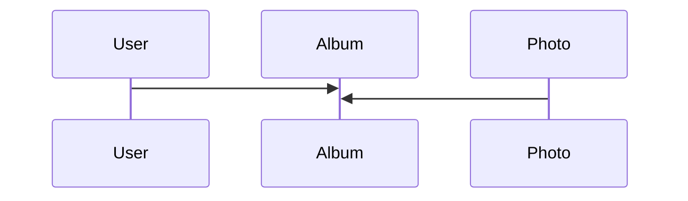

## Modèle

Un Album Content un User et une liste de photos

## Services
- DataServices
    - AlbumService
    - PhotoService
    - UserService
- Autres Services
    - ApiRouteGenerator
- Utils
    - DateUtils

## Autres
Les variables d'environements sont dans le fichier environment.ts et environment.prod.ts
